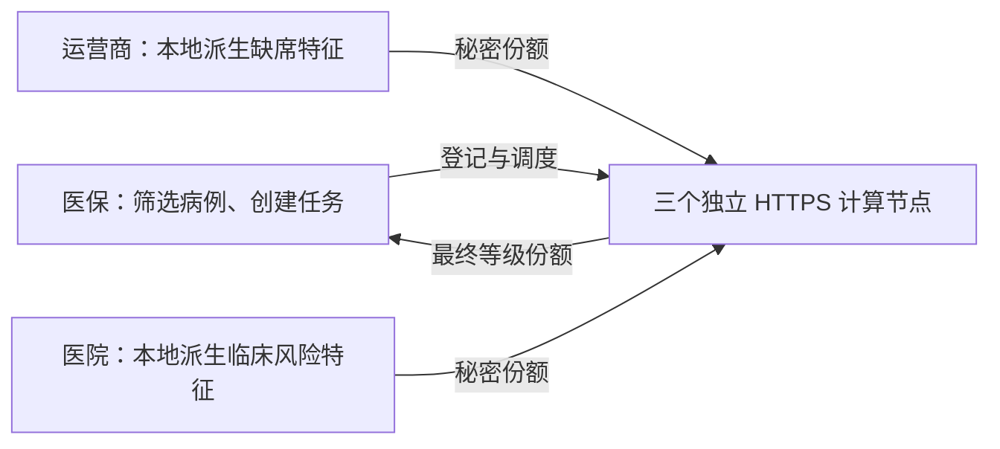
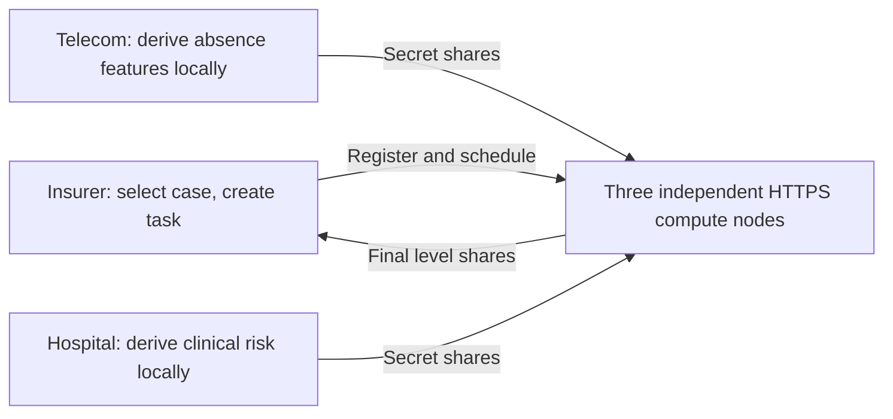

# 系统设计

[English](#english)

Mini MPC 面向医保、运营商和医院联合形成住院风险信号的场景。各机构本地读取记录并派生特征，三个计算节点处理秘密份额，医保方只重构最终风险等级。业务数据为合成样本，等级用于人工核查，不代表骗保事实。

## 架构与角色



机构节点与 MPC party 是不同角色。运营商和医院持有各自输入；医保发起任务并接收结果；每个 party 只存储属于自己 `party_id` 的份额。机构与 party 使用独立证书身份。

## 数据流与模型

审计窗口为审计日 22:00 至次日 08:00。医保只选取仍在住院、且入院时间不晚于窗口开始的记录。

| 数据来源 | 本地处理 | MPC 输入或用途 |
| --- | --- | --- |
| 医保住院状态、入院时间、住院记录号 | 筛选病例、创建任务 | 不作为私有评分输入 |
| 运营商位置时间、nCGI/TAI、医院覆盖映射 | 按小时聚合在院标记，统计缺席与连续缺席 | `telco_absence_hours`、`telco_max_absence_streak` |
| 医院诊断类别、严重程度、临床规则表 | 映射临床必要性不足风险分 | `clinical_need_score` |
| 已提交的特征份额 | 加权评分、共享值上的等级查表 | 最终 `risk_level` 份额 |

三个特征均为 0–10 的整数，业务权重须为非负整数。`clinical_need_score` 越高，表示临床信息越不支持住院。当前公开模型为：

```text
score = 6 × telco_absence_hours
      + 4 × telco_max_absence_streak
      + 3 × clinical_need_score
```

分数范围为 0–130；阈值为 20、45、80，对应 none、low、medium、high。权重和阈值是人为规则，未验证真实业务准确率。

MySQL 时间统一按本地无时区时间解释。事件 API 使用带时区输入时，须显式传入审计时区；事件、映射与窗口不得混用带时区和无时区时间。

患者联结键、医院和审计日期用于机构本地查询；party 任务清单只含会话、有效期、模型版本、分享参数、特征标识和接收者。当前联结键是模拟映射，任务路由标识也未完全与医保内部标识分离。

## 模块职责

| 层次 | 目录或模块 | 职责 |
| --- | --- | --- |
| 应用 | `applications/` | 领域对象、本方 view 读取、本地预处理、风险模型和机构 CLI |
| Backend | `runtime/backend.py`、`remote_backend.py` | 为应用提供计算与披露接口，隔离内存和远程实现 |
| 协议执行 | `runtime/session.py`、`remote_protocol.py`、`computation_plan.py` | 路由、BGW、Horner 编排及公开指令计划 |
| Party | `runtime/party.py`、`disclosure.py` | 本方份额存储、线性运算及指定接收者披露 |
| 网络服务 | `network/` | mTLS、身份映射、任务授权、HTTP 接口、执行状态和安全事件 |
| 协议规则 | `protocol/` | 通用参考协议、阈值校验及公开查表点 |
| 分享与数学 | `sharing/`、`math/` | Shamir、份额兼容性、有限域、插值与求值 |

`compute_insurance_audit_result` 接收任务、公开配置和 backend，不接收数据方明文特征。`InMemoryShamirBackend` 用于单进程对照与示例；`RemoteShamirBackend` 使用独立 HTTPS parties。外部 runtime 尚未接入。

## 执行与访问边界

医保向每个 party 登记同一有限期任务；数据方分别提交本方特征；医保按固定公开计划调度评分和分类，最后领取等级。计划复用于编排与服务端检查，避免两边维护不同步骤。

机构输入与 BGW 重分享使用不同接口。share store 拒绝冲突覆盖；会话执行器只维护下一步骤、原重分享缓存及已确认接收方。会话锁保护本地提交，网络发送在锁外进行，允许自身及 peer 接收重分享。完成步骤的精确重试只回执，完整计划完成后才交付结果。

三个机构用本方 view-only MySQL 账号读取数据。测试环境在一个 MySQL 容器中创建三个 schema，表达数据访问权限；它不等同于三个独立生产数据库。

## 设计取舍

- Shamir/BGW 适用于当前小整数算术模型；等级查表复用共享乘法，避免重构分数。值域扩大将增加计算和通信成本。
- 正式服务固定模型、协议参数及 peer 地址，拒绝任意权重查询、中间份额读取和重分享重定向。
- 内存状态支持同一进程内幂等与续传，没有跨重启恢复或持久化审计。
- 接口分离便于后续替换 backend，但不同 runtime 的安全模型和性能仍需独立验证。

协议见 [protocol.md](protocol.md)，安全边界见 [threat_model.md](threat_model.md)，运行与验证见 [running.md](running.md) 和 [testing.md](testing.md)。

---

# English

Mini MPC lets an insurer, telecom provider and hospital compute an inpatient risk signal. Each organization reads its own records and derives local features. Three compute nodes process secret shares. Only the insurer reconstructs the final risk level. Data is synthetic; results guide manual review.

## Architecture and roles



Organization nodes and MPC parties have separate roles and certificates. Telecom and hospital nodes own the inputs. The insurer starts the task and receives the result. Each party stores only shares for its own `party_id`.

## Data flow and model

The audit window runs from 22:00 on the audit date to 08:00 the next day. The insurer selects current inpatients admitted no later than the window start.

| Source | Local processing | MPC input or use |
| --- | --- | --- |
| Insurer stay status, admission time and record ID | Select cases and create tasks | No private scoring input |
| Telecom event time, nCGI/TAI and hospital cell map | Build hourly presence; count absence and longest streak | `telco_absence_hours`, `telco_max_absence_streak` |
| Hospital diagnosis category, severity and rules | Map to a clinical risk score | `clinical_need_score` |
| Submitted feature shares | Weighted scoring and lookup on the shared score | Final `risk_level` shares |

All three features are integers in 0–10; business weights must be non-negative integers. Higher `clinical_need_score` means weaker clinical support for inpatient care.

```text
score = 6 × telco_absence_hours
      + 4 × telco_max_absence_streak
      + 3 × clinical_need_score
```

Scores range from 0 to 130. Thresholds 20, 45 and 80 define none, low, medium and high. These rules have no validated real-world accuracy.

MySQL timestamps use one agreed local time without timezone information. Timezone-aware event inputs require an explicit audit timezone. Events, mappings and the window must not mix aware and naive timestamps.

The patient link key, hospital and audit date support local queries. Party manifests contain only the session, expiry, model version, sharing parameters, feature IDs and receiver. Patient linking uses a mock mapping. Routing IDs are not yet fully separated from internal insurer IDs.

## Module responsibilities

| Layer | Directory or module | Responsibility |
| --- | --- | --- |
| Application | `applications/` | Domain objects, local view access, preprocessing, model and role CLI |
| Backend | `runtime/backend.py`, `remote_backend.py` | Compute and disclosure interface for memory and remote execution |
| Protocol execution | `runtime/session.py`, `remote_protocol.py`, `computation_plan.py` | Routing, BGW, Horner scheduling and public instruction plan |
| Party | `runtime/party.py`, `disclosure.py` | Local share storage, linear operations and receiver-specific disclosure |
| Network service | `network/` | mTLS, identity mapping, task authorization, HTTP, execution state and security events |
| Protocol rules | `protocol/` | Reference protocols, threshold validation and public lookup points |
| Sharing and math | `sharing/`, `math/` | Shamir, share compatibility, field arithmetic, interpolation and evaluation |

`compute_insurance_audit_result` accepts a task, public configuration and backend. It accepts no plaintext features. `InMemoryShamirBackend` supports examples and reference tests. `RemoteShamirBackend` uses independent HTTPS parties. No external runtime is integrated.

## Execution and access boundaries

The insurer registers the same finite-lived task at each party. Data holders submit their features. The insurer schedules scoring and classification, then fetches the level. Scheduling and server checks share one public plan.

Organization inputs and BGW reshares use separate endpoints. The share store rejects conflicting writes. The executor tracks the next step, original reshares and confirmed recipients. Session locks protect local commits; network sends run outside the lock so local and peer reshares can arrive. Exact retries of completed steps only acknowledge completion. Results require the full plan to finish.

Each organization uses its own view-only MySQL account. One test container hosts three schemas; this models access control, not three separate production databases.

## Design choices

- Shamir/BGW fits the small integer model. Level lookup reuses shared multiplication without revealing the score. Larger ranges increase compute and communication costs.
- Services pin the model, parameters and peers. Arbitrary weights, intermediate-share reads and reshare redirects are rejected.
- Memory state supports retries within a running process. Restart recovery and durable audit are absent.
- Backend interfaces allow replacement. Each runtime still needs separate security and performance checks.

See [protocol](protocol.md#english), [security boundaries](threat_model.md#english), [running](running.md#english) and [testing](testing.md#english).
